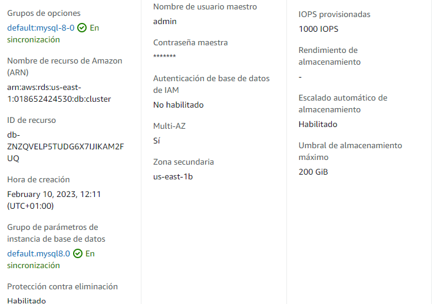

## Práctic a 4.6: Documentación final CLúster Web , MultiAZTarea

Queremos crear un Clúster de servidores webs con balanceo de carga para ello necesitaremos implementar una serie de elementos los cuales nos ayuden con el proyecto que tenemos en mente.
Cuando lo tengamos todo instalado el aspecto de nuestra implementación deberá ser una cosa así:
  

La instalación la dividiremos en tres niveles:
- En el primer nivel tendremos el balanceador, que es el que mostrara nuestro sitio web y será responsable de distribuir las solicitudes a dicho sitio para que no haya sobrecarga y en caso de caída de alguna instancia enviara las solicitudes a las instancias que sigan en pie.
- En el segundo nivel tendremos las instancias con las que crearemos nuestro sitio web
- En el tercer nivel tendremos las rds que nos serviran tanto como base de datos como soporte de respaldo de nuestra página. Una sera maestra y otra esclava, esta ultima solo podra leer los datos que estan en la maestra y suplir su trabajo en caso de que se caiga o entre en mantenimiento.

Comenzaremos la implementacion creando las instancias y el balanceador, ya que es lo mas simple pero necesita muchos pasos y sin esto no podriamos seguir con el resto del proyecto.

- Primero: Encendemos el laboratorio de Amazon y nos vamos a la pestaña EC2.
  - Nos vamos a la pestaña Security Groups y creamos un grupo nuevo al que llamaremos SGweb
    
  Aqui pondremos tanto la regla del puerto http como la del puerto ssh para que podamos acceder a ella desde cualquier lugar y lo pueda ver cualquier persona que se conecte a ella.
    
  Creamos el grupo de seguridad SGefs
    
  - Configuramos el grupo EFS para que solo accedan a el los que vengan del grupo SGweb.
  - Creamos una instancia a la que llamamos Linux_01, que tendra un amazon linux y las par de claves que utilizaremos seran el vockey y le ponemos como grupo de seguridad el grupo SGweb que creamos anteriormente. Editaremos las opciones de configuracion de red y le pondremos que coja como opción de subred la zona disponible terminada en 1a.
    
  - Una vez que tengamos toda la configuracion de la ec2 nos iremos a Datos de usuario y copiaremos los siguientes comandos
    
  Una vez terminada de montar y configurar la intancia le daremos a lanzar y nos comprobara si tiene algun error, de no tenerlo se nos crearia correctamente y ya podriamos trabajar con ella 
  Nos iriamos a crear la instancia 2 siguiendo los mismos pasos que antes pero cambiando algunos datos de la configuración. 
      
  Esta seria la configuración que tendria nuestra Linux_02. Le pondremos los mismos comandos que a Linux_01 para que nos instale los mismos programas 
      
  Aquí tendriamos las ec2 necesarias para trabajar ya configuradas.

- Segundo: Nos iremos a la pestaña EFS y crearemos nuestro sistema de archivos. Lo llamaremos minfs y le pondremos el grupo de seguridad por defecto, tambien le pondremos que nos coja todas las zonas de disponibilidad posibles.
    
  Cuando lo creemos nos llevara a la pestaña donde se encuentran todos los sistemas de archivos y veremos que el nuestro ya se encuentra disponible y que lo tenemos cifrado. Lo que necesitamos de este sistemas de archivos es el id que nos proporciona amazon.
      
  Una vez que lo tenemos ya montado, nos vamos a la configuracion de minfs y pulsaremos en la pestaña Red. Dentro de esta pestaña esperaremos a que cargue todas las ips y le daremos a administrar. Dentro de la administración le pondremos a las zonas 1a y 1b el grupo de seguridad SGefs. Podriamos configurar todas las ip que nos salen pero como solo tenemos dos instancias creadas es algo innecesario, en el caso de crear mas instancias tendriamos que acordarnos de venir aqui y configurar las que sean necesarias 
      

- Tercero: Ya que tenemos configuradas las ec2 y la efs, nos conectamos a las dos instancias de ec2 para empezar a trabajar con ellas. Lo primero que haremos sera comprobar si se nos instalo bien apache2 que al ser la maquina de amazon linux tenemos que comprobar que esta httpd bien instalado.
  Primero nos metemos en Linux_01 y ponemos el comando sudo systemctl status httpd para saber el estado del servicio
    
  Ahora iremos a Linux_02 y haremos lo mismo que con Linux_01
    
  Ya que tenemos la comprobación hecha nos vamos al directorio /var/www/html y creamos una carpeta a la que llamaremos efs-mount. Como nos da error de permisos usaremos el comando sudo su para crearla y evitar ese error.
    
  Nos iremos a nuestro sistema de archivos y copiaremos el id en el siguiente comando: sudo mount -t nfs -o nfsvers=4.1,rsize=1048576,wsize=1048576,hard,timeo=600,retrans=2,noresvport fs-09d8395cbf7d9bf1c.efs.us-east-1.amazonaws.com:/ efs-mount. Y donde pone fs-... lo cambiamos por el id de nuestra maquina que es fs-0e9c460105d650353 y se nos quedaria el siguiente comando que es el que debemos usar; sudo mount -t nfs -o nfsvers=4.1,rsize=1048576,wsize=1048576,hard,timeo=600,retrans=2,noresvport fs-0e9c460105d650353.efs.us-east-1.amazonaws.com:/ efs-mount.
  Copiamos el comando dentro de la carpeta creada anteriormente y ponemos el comando df -h para ver que efectivamente se nos ha creado la carpeta y que apunta a nuestro id. 
    
  Como el comando mount se nos desmonta cada vez que apagamos las instancias lo que debemos hacer es irnos al archivo fstab y ponemos el comando sudo nano /etc/fstab para poder modificarlo. Dentro del archivo añadiremos el id del EFS y la carpeta donde estara montado permanentemente, en mi caso el comando quedaria asi:
  fs-0e9c460105d650353.efs.us-east-1.amazonaws.com:/ /var/www/html/efs-mount nfs defaults 0 0.
  Guardaremos los cambios y reiniciaremos hpptd por si acaso luego nos da posible errores.
  Luego pondremos un wget que en nuestro caso sera de Netflix y dejaremos que nos instale todos los datos.
    
  Ya que hemos instalados los paquetes le damos a descomprimir el paquete intalado para poder manejar lo archivos que tenemos dentro
    
  Repetiremos el mismo proceso en la maquina de Linux_02
  Cuando hayamos configurado todos los comandos de la segunda ec2, nos iremos a la ip de la primera ec2 y comprobaremos que poniendo las ip de ambas maquinas accedemos a la página de Netflix.
    
    

- Cuarto: Una vez terminada toda la configuración de las instancias linux nos iremos a crear una ec2 con el nombre de balanceador, en la cual trabajaremos para que todo lo que hemos visto en las otras instancias nos la muestre esta. Lo primero que debemos hacer antes de ponernos con la configuración del balanceador es asignarle ips elasticas a nuestras instancias linux.
    
  Como tambien tendremos que consultar varias veces en momentos no consecutivos la ip del balanceador, le asignaremos a este támbien una ip elastica para que no tengamos que estar mirando su ip cada vez que queramos hacer una comprobacion o un reinicio 
  Ya que tenemos las ips asignadas nos iremos al balanceador. Haremos un update para actualizar el sistema e instalaremos apache2. Cuando este terminada la instalación miraremos el estado de apache para ver si esta activado.
  Ya que hemos comprobado que apache funciona lo que haremos sera instalar los comandos de a2enmon iremos uno por uno para ver si nos da algun error, en principio no deberia ya que tenemos la instalación hecha correctamente. 
    
  Cada vez que metemos algun comando nos pone que esta instalado o que esta activo y lo unico que debemos hacer es reiniciar apache2 para que se activen.
  Luego nos iremos al directorio /etc/apache2/sites-enabled para editar el archivo 000-default.conf que esta dentro de esta carpeta.
  En este archivo nos iremos a la parte final y en la penultima linea del documento pondemos las etiquetas necesarias para que cuando pongamos la ip del balanceador nos salga la informacion del index que tenemos en las instalacias linux creadas y configuradas anteriormente 
    
  Guardaremos los cambios realizados en el archivo y reiniciaremos apache para que se efectuen los cambios realizados.
  En una pestaña nueva del navedador pondremos la ip del balanceador para ver si nos funciona y comprobaremos si cuando ponemos /balancer-manager para ver si podemos controlar como se visualiza la información que tenemos dentro del index situados en las otras instancias.
    
  Ahora pondremos la ip con /balancer-manager para ver si esta funciona correctamente como el index.
    
  Importante para una correcta securización debemos poner la ip privada del balanceador en la regla http del grupo de seguridad sgweb, asi lo que hacemos es que solo puedan acceder las ip que vengan de ese grupo
    
    En la imagen aparece la regla ssh, deberemos quitarla despues de terminar el montaje ya que eso seria una falla de seguridad y solo la estamos usando para poder acceder al montaje de dicho proyecto

- Quinto: Como queremos que nuestras instancias trabajen con una base de datos instalaremos php para poder guardar los datos añidos en nuestra página de forma permanente. Tambien nos servira de visualizacion de dicha página. Para ello nos iremos a este enlace para seguir los pasos de instalación https://arstech.net/install-php-7-on-amazon-linux-2/. Lo haremos en ambas maquinas ya que al ser una instalación no se nos crea las dos a la vez, tenemos que ir una por una. 
En la página hace una instalación de php 7.4 nosotros queremos la 8.0 que es mas reciente. Seguiremos los comandos del enlace pero los modificaremos a nuestra propia instancia para la correcta instalación. Una vez añadidos todos los comandos pasaremos a reiniciar apache para visualizar la actualización de la página.

- Sexto: Nos vamos a la carpte /var/www/html/efs-mount y agregamos los siguientes archivos:
  - Formulario.php
  - Grabar.php
  - Conexion.php
  - Con esto lo que hacemos es enlazar la rds con el balanceador y guardar los datos y en nuestro caso las donaciones que haran los usuarios que visiten la web

- Septimo: Creamos la rds con el motos de Mysql y la pondremos multiAZ para que en caso de caida sigamos trabajando con la rds esclava y no interrumpir el flujo de trabajo. 
    
    
  Para la securización de la rds pondremos las siguientes reglas de entrada:
    
  Para ver y controlar los datos de la base de datos nos crearemos una ec2 con windows en la cual instalaremos Heidisql para trabajar con los datos registrados de la web. Para ello lo que tenemos que hacer es poner en los archivos php el endpoint de nuestra maquina. Para la conexion de Heidi con la rds usaremos el endpoint y dentro de esta crearemos la base de datos que manipularemos. 
    
  Y con esto ya tendriamos nuestro proyecto terminado 